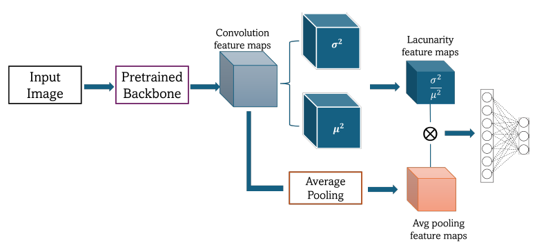

# Lacunarity Pooling Layers for Plant Image Classification using Texture Analysis:
**Lacunarity Pooling Layers for Plant Image Classification using Texture Analysis**

_Akshatha Mohan and Joshua Peeples_



Note: If this code is used, cite it: Akshatha Mohan and Joshua Peeples. This code's public release is a work-in-progress and will be cleaned up following submissions to arXiv and CVPR Vision for Agriculture Workshop

[`Zendo`](https://zenodo.org/records/11561363). 
[]

[`IEEE Xplore (CVPRW)`](https://openaccess.thecvf.com/content/CVPR2024W/Vision4Ag/papers/Mohan_Lacunarity_Pooling_Layers_for_Plant_Image_Classification_using_Texture_Analysis_CVPRW_2024_paper.pdf)

[`arXiv`](https://openaccess.thecvf.com/content/CVPR2024W/Vision4Ag/html/Mohan_Lacunarity_Pooling_Layers_for_Plant_Image_Classification_using_Texture_Analysis_CVPRW_2024_paper.html)

[`BibTeX`](https://github.com/Advanced-Vision-and-Learning-Lab/2024_V4A_Lacunarity_Pooling_Layer/tree/main#citing-lacunarity-pooling-layers-for-plant-image-classification-using-texture-analysis)

In this repository, we provide the paper and code for the "Lacunarity Pooling Layers for Plant Image Classification using Texture Analysis."

## Installation Prerequisites

This code uses python and necessary packages in pytorch
Please use [`Pytorch's website`](https://pytorch.org/get-started/locally/) to download necessary packages.

## Demo

Run `demo.py` in Python IDE (e.g., Spyder) or command line. 

## Main Functions

The Lacunarity Pooling layer runs using the following functions. 

1. Intialize model  

```model, input_size = intialize_model(**Parameters)```

2. Prepare dataset(s) for model

 ```dataloaders_dict = Prepare_Dataloaders(**Parameters)```

3. Train model 

```train_dict = train_model(**Parameters)```

4. Test model

```test_dict = test_model(**Parameters)```


## Parameters
The parameters can be set in the following script:

```Demo_Parameters.py```

## Inventory

```
https://github.com/Advanced-Vision-and-Learning-Lab/V4A_Lacunarity_Pooling_Layer

└── root dir
	├── demo.py   //Run this. Main demo file.
	├── Demo_Parameters.py // Parameters file for demo.
	├── Prepare_Data.py  // Load data for demo file.
	├── View_Results.py // Run this after demo to view saved results.
    	├── Datasets
		├── Get_transform.py // Transforms applied on test, train, val dataset splits
		├── Pytorch_Datasets.py // Return Index for Pytorch datasets
		├── Pytorch_Datasets_Names.py // Return names of classes in each dataset
		├── Split_Data.py // Returns data splits for train, test and validation
	└── Utils  //utility functions
		├── Compute_FDR.py  // Compute Fisher Score
		├── Confusion_mats.py  // Create and plot confusion matrix.
		├── Generating_Learning_Curves.py  // Plot training and validation accuracy and error measures.
		├── Generate_TSNE_visual.py  // Create TSNE visual for results.
		├── Network_functions.py  // Contains functions to initialize, train, and test model. 
		├── pytorchtools.py // Function for early stopping.
		├── CustomNN.py // Contains the shallow neural network and densenet161 model implementation
		├── Timm_Models.py // Contains the timm models implementation
		├── Computer_sizes.py // Function for computing features for fully connected layer
		├── DBC.py // Compute Differential BoX Counting pooling layer
		├── Multi_Scale_Lacunarity.py // Compute Multi-scale pooling layer
		├── Base_Lacunarity.py // Compute Base lacunarity pooling layer
		├── Lacunarity_Pooling.py // Contains fusion pooling approach for all lacunarity layer
		├── Fractal_Pooling.py // Contains fractal pooling approach
		├── xai_methods.py //Function to visualize EigenCAM on feature maps
    	├── Save_Results.py  // Save results from demo script.
		
```

## License

This source code is licensed under the license found in the [`LICENSE`](LICENSE) 
file in the root directory of this source tree.

This product is Copyright (c) 2023 A. Mohan and J. Peeples. All rights reserved.

## <a name="CitingLacunarity"></a>Citing Lacunarity Pooling Layers for Plant Image Classification using Texture Analysis

If you use the code, please cite the following 
reference using the following entry.

**Plain Text:**

A. Mohan and J. Peeples, “Lacunarity Pooling Layers for Plant Image Classification using Texture Analysis”, Proceedings of the IEEE/CVF Conference on Computer Vision and Pattern Recognition (CVPR) Workshops, 2024, in Press.

**BibTex:**
```
@inproceedings{mohan2024lacunarity,
  title={Lacunarity Pooling Layers for Plant Image Classification using Texture Analysis},
  author={Mohan, Akshatha and Peeples, Joshua},
  booktitle={2024 Agriculture-vision IEEE/CVF CVPR 2024},
  pages={950-953},
  year={2024},
  organization={CVPR}
}

```
